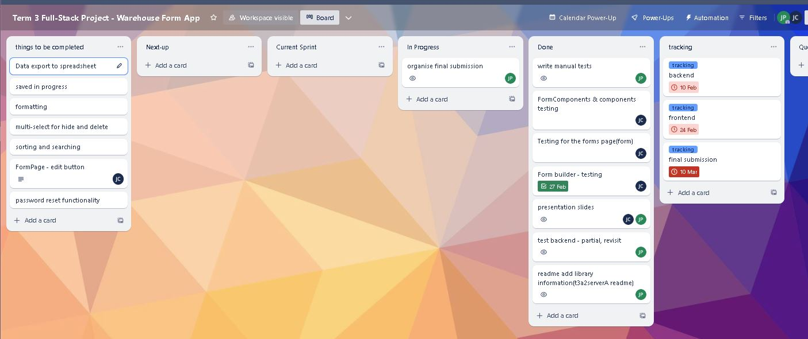

# T3A2-B - Stream-lined Form application by James/Jit

### navigation 
[Presentation](./ppt/presentation.pdf)
[Jump to Part A](#PartA)
[Jump to Part B](#PartB)

<a id="PartA"></a>

# Part A

## R1	Description of your website, including:
- Purpose
    
    To streamline the workflow within the working environment by providing a user-friendly platform for submitting and managing various forms. The system seeks to enhance communication and overall efficiencies involved with mid-large scale warehouse settings. 

- Functionality / features
    - Different form types and ability to create new forms. e.g. Incident report form, parts request form, receiving error forms, stock count request form, bin changes request form to name a few.
    - Every user will be able to lodge forms.
    - Different users will be granted access to be able to approve forms or read forms submitted forms. (permanent delegation)
    - Actions can be added to the forms that are assigned to a user to complete. (temporary delegation)
    - Upload functionality
    - search specific submissions
    - group search a form type
    - alter self submitted forms, cannot alter someone else's submission.
    - download portion of the information as spreadsheet data
    - user accounts
    - access restrictions for form building and data deletion
    - restricting viewing access of completed forms

- Min viable product will include;
    - form builder
    - different form types
    - user accounts
    - form lodging
    - form viewing
    - action to change status to complete

- Target audience
    - Warehouse Teams
    - HR Safety Compliance Officer

- Tech stack	GENERAL
    - MERN
        - MongoDB
        - ExpressJS
        - React
        - NodeJS

## R2	Dataflow Diagram	


## R3	Application Architecture Diagram	


## R4	User Stories 

##### Sam (warehouse manager) Doesn't have time to deal with every issue little issue himself. Likes to use data analysis to direct decision making. Cares about the well-being of his team. Wants to streamline as much as possible to eliminate hiccups in the processes.

- As Sam, I want to be able to delegate the specific forms, so I can focus on the more important ones.
    - [x] Assign users when building new forms
    - [x] Re-assign forms 
- As Sam, I want to be able to extract this data for analysis, So I can find trends and adapt the warehouse processes or report to my boss how well things are going.
    - [ ] Export spreadsheet of form listings
- As Sam, I want to be able to make new form types or change the ones I have, So I can feel in control of my warehouses processes.
    - [x] Form builder
    - [ ] Add functionality to modify forms
- As Sam, I want the team to at least give me certain points of information, sometimes they don't give me enough to do anything with.
    - [ ] implement requirement flag for fields in form builder

##### Justin (warehouse manager) Tech saavy valuing efficiency. Security-concious prioritizing data protection.

- As Justin, I want the form app to have a search or filter feature, enabling me to quickly locate specific forms or entries within a large dataset.
    - [ ] filter on forms page
- As Justin, I also want to have the form app to have security measures, ensuring that sensitive information is protected & accessible only to authorized users.
    - [x] user login and repeat authorization checks
    - [x] user access levels

##### Thomas (HR manager) concerned about the well-being of the team. Likes to have everything neatly in order and easily accessible. Sports fanatic.

- As Thomas, I want to have pictures of any incidents, so that I can make my own judgements on the situation.
    - [ ] upload data/images to forms
    - [ ] view screenshots of uploaded data/images
- As Thomas, I want to be able to direct team members to take certain actions from a request submission and confirm they've completed them, so that I can feel confident incidents are dealt with properly.
    - [x] Actions requests against filled out forms

##### Bob (warehouse employee) Just wants to get the job done and go home. Not overly concerned about the things going on around him. Keeps to themselves. Old school, doesn't like technology

- As Bob, I want to be able to fill out a hard copy, so I can avoid using my phone/computer.
    - [ ] TesseractJS for optical Character Recognition

##### Daisy (warehouse employee) Cares about everything little thing. Likes to gossip and a stickler for the rules. Energetic, productive.

- As Daisy, I want to be able to understand what's going on easily, So I don't waste my time trying to understand what's being asked of me.
    - [ ] User Instructions
- As Daisy, I want to be able to alter my own submissions or delete them, So that If I make a mistake I don't need to speak to my manager about it every time.
    - [ ] Form cancellation/deletion for user
- As Daisy, I want to be able to take a picture while submitting, so that I can feel confident that Sam knows what I'm talking about.
    - [ ] photo upload
    - [ ] optionally take photo in browser, recommended material - https://www.youtube.com/watch?v=4sLUfUGLEp0, by Tyler Potts

##### Wendy (warehouse employee) Middle aged working employee. Memory recall is not the best. Like to talk about her granddaughters and her next holiday.

- As Wendy, I want the form app to allow attachments, enabling me to include relevant documents or files with my form submissions.
- [ ] attachment upload to the form
- As Wendy, I want to be able to submit the forms from my phone, so I don't have to wait till I go home or request admin to use their computer.
- [ ] phone viewport compatible
- As Wendy, I want to know that my form was submitted successfully with an email confirmation, so that I can have the reassurance that it was received and evidence if asked. 

## R5	Wireframes for multiple standard screen sizes, created using industry standard software

options:

1. Complete wireframe PDF. viewing from this document will provide comments and actual embedded links for navigating the wireframe [FinalProject Wireframe pdf](./docs/WireFrame/FinalProject.pdf)
2. Balsamiq project file with comments as an alternative - [FinalProject Wireframe bmpr](./docs//WireFrame/FinalProject.bmpr)
3. The below images - no links embedded

#### Sign In 


#### Account Creation


#### Home


#### Form Builder


#### Form Builder - Preview Form


#### Forms


#### Forms - Form selected


#### Forms - Fill out form


#### Actions - Assignee


#### Actions - Assigner


#### Actions - Empty


#### Closed Form


## R6	Screenshots of your Trello board throughout the duration of the project	

25th - Jan

27th - Jan

28th - Jan

29th - Jan

30th - Jan

01st - Feb

03rd - Feb

04th - Feb

05th - Feb

09th - Feb

12th - Feb

14th - Feb

16th - Feb

18th - Feb

21st - Feb

25th - Feb

27th - Feb

1st - Mar

5th - Mar

7th - Mar

10th - Mar


<a id="PartB"></a>

# Part B

## Production Website Links

Front End
https://stream-lined.netlify.app
Back End
https://stream-linedd-8391d4c8cf39.herokuapp.com


## Repository Links

Front End 
https://github.com/pipersjames/t3a2react-app
Back End
https://github.com/JitCHEO/t3a2serverA

## Packages Implemented

##### Front End:

@fortawesome/fontawesome-free: Provides scalable vector icons that can be customized and styled easily. [Documentation](https://fontawesome.com/)

* used in ShortQA and LongQA components for pencil icon

Bootstrap: A popular front-end framework for developing responsive and mobile-first websites. It provides CSS and JavaScript components for layout, forms, navigation, and more. [Documentation](https://getbootstrap.com)

* used throughout the application with bootstrap specific class names and bootstrap components e.g. modals, tables, col, row, button etc.

Ant Design (antd): A design system for enterprise-level products. It provides a set of high-quality React components and layouts. [Documentation](https://ant.design/)

* used when bootstrap did not offer the design wanted. e.g. ActionsMenu has menu component native to antd

js-cookie: A simple, lightweight JavaScript API for handling browser cookies. [Documentation](https://www.npmjs.com/package/js-cookie)

* used to store and recover jwt from cookies. also used to store current access levels assosciated with the user

Moment.js: A JavaScript library for parsing, validating, manipulating, and formatting dates and times. [Documentation](https://www.npmjs.com/package/moment)

* used to convert date objects to a more readable state. implemented in table of the FormPage and added comments to completed forms

React: A JavaScript library for building user interfaces, particularly single-page applications. [Documentation](https://react.dev/)

* what made this application possible. design layout based on this library. use of jsx components.


react-router-dom: Provides routing capabilities for React applications, enabling navigation between different components based on the URL. [Documentation](https://www.npmjs.com/package/react-router-dom)

* used to add a layer of navigation. e.g. navlinks in the navbar. useNavigate to redirect the user when conditions are met. extracting parameters when needed.

###### Front End Development dependencies:

Jest: A JavaScript testing framework maintained by Facebook. It is widely used for unit and integration testing of JavaScript code, particularly in React applications. [Documentation](https://jestjs.io/)

* used to build and run tests. testing framework implemented through github actions for intended CI.


##### Back End:

bcryptjs: A library to help hash passwords. It uses bcrypt algorithm to securely hash passwords. [Documentation](https://www.npmjs.com/package/bcryptjs)

* hashes all newly created passwords of new users. used to check hashed passwords as well in the verification steps, refer userAuthFunctions.js

cors: Cross-Origin Resource Sharing (CORS) middleware for Express.js, allowing you to enable CORS with various options. [Documentation](https://www.npmjs.com/package/cors)

* cors options limit the addresses that can access the application to the production and development site locations only, refer server.js

dotenv: Loads environment variables from a .env file into process.env. Useful for managing configuration settings in Node.js applications. [Documentation](https://www.npmjs.com/package/dotenv)

* loads the environment variables. refer .env example for what is used

Express.js: A web application framework for Node.js that simplifies the process of building server-side web applications. [Documentation](https://expressjs.com/)

* establishes all the listening fuctionality and running of the connection API. implemented in the server, index, database files

jsonwebtoken: A JSON Web Token (JWT) implementation for Node.js. It allows you to generate and verify JWTs, which are commonly used for authentication and authorization. [Documentation](https://www.npmjs.com/package/jsonwebtoken)

* as described, refer userAuthfunctions and UserController for implementation

Mongoose: An Object Data Modeling (ODM) library for MongoDB and Node.js. It provides a straight-forward, schema-based solution for modeling application data. [Documentation](https://mongoosejs.com/)

###### Back End Development dependencies:

Jest: Same as above, used for testing backend JavaScript code.

*primary testing framework, implemented with github actions

mongodb-memory-server: A tool to run an in-memory MongoDB instance for testing purposes. [Documentation](https://www.npmjs.com/package/mongodb-memory-server)

* used in the model test to create and test mock models

Nodemon: A utility that monitors changes in your Node.js application and automatically restarts the server. Useful for development. [Documentation](https://www.npmjs.com/package/nodemon)

* used to restart the development server when changes are made

Supertest: A library for testing HTTP servers in Node.js. It allows you to send HTTP requests and assert responses, making it useful for integration testing. [Documentation](https://www.npmjs.com/package/supertest)

* for testing with server requests, refer controller tests


## Testing 

##### code driven
Testing CI built into both backend and front end components through Github actions.

run ```npm test``` in the front end to get a coverage report

run ```npm run test-cc``` for coverage report in the backend


##### Manual tests

* [Manual Tests - Round 1](./docs/manual%20Tests/Final%20Project%20-%20Round%201.pdf)

##### Production website testing with client

Comments from Allie on wednesday 5th of March
* confusing naming convention
* felt lost navigating around
* deleted a template by accident wanting to delete a user record
* in browser navigation did not work as expected
* large typing line showing up on some of the elements

## Attributions

Favicon - <a href="https://www.flaticon.com/free-icons/document" title="document icons">Document icons created by Freepik - Flaticon</a>

Login Background - Image by <a href="https://pixabay.com/users/prawny-162579/?utm_source=link-attribution&utm_medium=referral&utm_campaign=image&utm_content=1082217">Prawny</a> from <a href="https://pixabay.com//?utm_source=link-attribution&utm_medium=referral&utm_campaign=image&utm_content=1082217">Pixabay</a>

line divider - Image by <a href="https://pixabay.com/users/gdj-1086657/?utm_source=link-attribution&utm_medium=referral&utm_campaign=image&utm_content=7551966">Gordon Johnson</a> from <a href="https://pixabay.com//?utm_source=link-attribution&utm_medium=referral&utm_campaign=image&utm_content=7551966">Pixabay</a>


Coffee Robot - Image by <a href="https://pixabay.com/users/juliush-3921568/?utm_source=link-attribution&utm_medium=referral&utm_campaign=image&utm_content=8520523">Julius H.</a> from <a href="https://pixabay.com//?utm_source=link-attribution&utm_medium=referral&utm_campaign=image&utm_content=8520523">Pixabay</a>

Chatgpt

